# 数据集管理系统

## 目录
1. [技术栈说明](#技术栈说明)
2. [系统架构](#系统架构)
3. [数据流程](#数据流程)
4. [数据库到后端交互](#数据库到后端交互)
5. [后端到前端交互](#后端到前端交互)
6. [完整业务流程](#完整业务流程)
7. [文档说明](#文档说明)

---

## 技术栈说明

### 后端技术栈（Java）

| 技术组件 | 版本 | 作用说明 |
|---------|------|---------|
| **Java** | 17+ | 后端开发语言，长期支持版本 |
| **Spring Boot** | 3.x | 应用框架，整合MVC、安全、数据访问、消息、定时等能力 |
| **Spring MVC** |  | Web层，提供REST API与拦截器体系 |
| **Spring Security** | 6.x | 认证授权，支持JWT/Token，方法级鉴权 |
| **Spring Data JPA** |  | ORM层，简化PostgreSQL数据访问，支持分页与审计 |
| **Spring AMQP / RabbitMQ** |  | 消息队列，分发解析、指标计算、报告生成等异步任务 |
| **Spring Batch** |  | 批处理框架，可用于大批量数据导入与转换 |
| **springdoc-openapi** | 2.x | 自动生成OpenAPI 3.0文档与Swagger UI |
| **PostgreSQL Driver** |  | JDBC驱动，与数据库通信 |
| **Redis (lettuce)** | 6+ | 缓存与分布式锁，可选任务进度存储 |
| **Apache POI** | 5.x | Excel/Word/PPT读写与报告生成 |
| **Jackson / OpenCSV** |  | CSV/JSON解析工具链 |
| **JFreeChart / XChart** |  | 服务器侧图表生成（如需要导出PNG/SVG） |

### 离线处理工具（Python，本地）

| 技术组件 | 版本/示例 | 作用说明 |
|---------|---------|---------|
| **Python** | 3.10+ | 本地离线计算与解析语言 |
| **pandas / NumPy / Polars** |  | 数据清洗、特征计算、批量指标生成 |
| **python-can / cantools** |  | BLF/ASC解析、DBC信号解码（迁移自服务器端） |
| **OpenPyXL / pyarrow** |  | Excel读写、列式存储输出（Parquet/Feather/CSV） |
| **Pillow / OpenCV / ffmpeg** |  | 图片/视频等非结构化数据预处理 |
| **Jinja2 / Matplotlib / Plotly (可选)** |  | 本地调试可视化或导出静态图（不负责最终报告） |
| **Typer / FastAPI (可选)** |  | CLI或轻量本地服务壳，方便管理员使用 |

### 前端技术栈

| 技术组件 | 版本 | 作用说明 |
|---------|------|---------|
| **Vue.js** | 2.0 | 构建SPA界面 |
| **Vue Router** | 3 | 路由管理 |
| **Vuex** | 3 | 全局状态管理（数据集、文件、指标、报告） |
| **Element UI** |  | UI组件库（表格/表单/对话框） |
| **ECharts** |  | 数据可视化图表 |
| **Axios** |  | HTTP客户端，封装认证与错误处理 |

### 中间件与工具

| 组件 | 作用说明 |
|-----|---------|
| **RabbitMQ** | 任务队列与消息分发 |
| **Nginx** | 反向代理与静态资源分发，HTTPS终结 |
| **Docker / Docker Compose** | 部署编排，隔离服务依赖 |
| **Node.js** | 前端构建与包管理（Vue 2 构建工具链） |
| **Flyway / Liquibase** | 数据库变更管理，保证DDL一致性 |
| **Lombok / MapStruct** | 代码简化与DTO映射 |

---

## 系统架构

### 后端计算外移 + 双库映射

- 后端服务器不承担重计算；包括BLF/ASC车辆CAN解析在内的重计算全部转移到本地Python处理器。
- 按功能拆分双库：原始数据库（Raw DB）存放上传文件及其元数据；指标结果库（Metrics DB）存放离线处理后的指标数据（报告在前端/后端按需生成，来源于Metrics DB）。
- 双库通过`dataset_id`/`file_id`等全局唯一键关联，前端可溯源到原始文件。
- Web端两条通路：上传原始数据 → Raw DB；上传离线计算结果（指标） → Metrics DB。
- 管理员本地工作流：从Raw DB/对象存储下载原始文件 → 本地Python工具解析/计算 → 上传指标结果（不上传报告）。

### 整体架构图

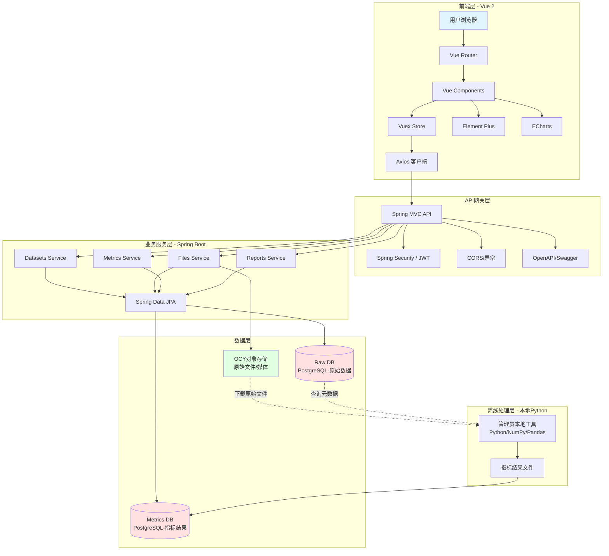

### 架构层次说明

**1. 前端层 (Vue 2)**
- 路由与导航：Vue Router管理页面
- 状态管理：Vuex集中管理数据集、文件、指标、报告
- UI与可视化：Element UI + ECharts
- API通信：Axios统一封装Token、超时与错误

**2. API网关层**
- RESTful API：Spring MVC控制器 + 全局异常处理
- 认证授权：Spring Security + JWT，方法级鉴权
- 跨域：CORS过滤器支持前后端分离
- API文档：springdoc-openapi生成OpenAPI/Swagger UI

**3. 业务服务层（后端聚焦编排与存取）**
- Datasets服务：CRUD、元数据管理、关联键下发
- Files服务：上传、格式验证、对象存储签名URL
- Metrics服务：接收管理员上传的指标结果、校验数据结构、写入Metrics DB
- Reports服务：基于已存指标生成轻量报告或转发下载
- 异步/批处理：后端仅保留轻量任务（通知/审计）；重计算转移到本地Python工具

**4. 离线处理层（本地Python工具）**
- 解析原始数据（Excel/CSV/BLF/ASC等）、处理非结构化数据（图片/视频）
- 计算指标并输出标准化结果文件（如Parquet/CSV/JSON），不生成最终报告
- 负责DBC信号解码、时间对齐等重计算任务

**5. 数据层（双库 + 对象存储）**
- Raw DB：保存元数据、上传记录、原始数据行表（如需要），记录OCY存储位置信息
- Metrics DB：保存指标结果、报告元数据（由后端/前端基于指标生成），可视化所需聚合表
- 对象存储（OCY服务器）：原始文件、媒体，报告可由后端生成后存放此处

**Raw DB与OCY对象存储关联说明**
- 标识：`dataset_id`、`file_id`全局唯一，贯穿Raw DB与Metrics DB。
- Raw DB存储字段：`storage_type=OCY`、`bucket/namespace`、`object_key/path`、`size`、`checksum`、`version`、`content_type`、`encrypt_flag`。
- 下载流程（前端）：前端携带`fileId`/`datasetId`调用`GET /api/files/{fileId}` → 后端查Raw DB元数据 → 基于OCY生成短期签名URL或代理下载 → 前端跳转下载/预览（前端不接触OCY密钥）。
- 指标溯源：Metrics DB保留`dataset_id`/`file_id`，前端在指标详情页可通过这对键请求原始文件下载接口，后端按上述流程签名OCY URL，实现指标→原始文件的闭环。

**标识生成与分发规范**
- `dataset_id`：ULID/UUIDv7，后端生成并在创建数据集时返回；唯一覆盖Raw/Metrics两库。
- `file_id`：ULID/UUIDv7，后端在文件上传登记时生成；同一`dataset_id`下可多文件。
- 分发：创建数据集接口下发`dataset_id`；上传文件接口下发`file_id`；离线指标上传需携带两者用于溯源与幂等校验。

**API草案**
- 上传原始：`POST /api/files` (multipart 或直传授权) → 返回`fileId`、`datasetId`、`uploadUrl?`。
- 下载原始：`GET /api/files/{fileId}` → 返回签名URL、过期时间、文件名、contentType。
- 上传指标：`POST /api/metrics/upload` (body含`datasetId`、`fileId`、指标JSON/CSV/Parquet元数据、可选报告生成指示) → 写入Metrics DB。
- 查询指标：`GET /api/datasets/{datasetId}/metrics` 或 `GET /api/files/{fileId}/metrics` → 返回指标结果、报告URL（若已生成）。

**Raw DB / Metrics DB 表结构规划（简版）**
- Raw DB
    - `dataset`：`dataset_id`(pk)、`name`、`desc`、`created_by`、`created_at`、`status`
    - `file`：`file_id`(pk)、`dataset_id`(fk)、`filename`、`storage_type`、`bucket`、`object_key`、`size`、`checksum`、`content_type`、`version`、`encrypt_flag`、`status`、`created_at`
    - （可选）`raw_row_xxx`：小表存样本/解码少量行，非必需
- Metrics DB
    - `metric_result`：`id`(pk)、`dataset_id`、`file_id`、`metric_name`、`metric_value`（JSON/NUMERIC）、`metric_type`、`calculated_at`、`source_tool_version`
    - `metric_blob`：`id`(pk)、`dataset_id`、`file_id`、`payload`(JSONB/Parquet reference)、`schema_version`
    - `report`：`id`(pk)、`dataset_id`、`file_id`、`report_type`、`storage_type`、`bucket`、`object_key`、`generated_at`

**同步与一致性策略**
- 只读关联：以`dataset_id`/`file_id`在两库对齐，不做跨库JOIN；前端或后端读两次并在应用层合并。
- 幂等写：指标上传若已存在同`dataset_id`/`file_id`且`metric_type`相同，可选择覆盖或版本化。
- 延迟同步：如需报表物化表，可用定时Job从Metrics DB汇总生成只读视图/缓存，不反写Raw DB。

**GET /api/files/{fileId} 响应示例**
```json
{
    "fileId": "01JABC...",
    "datasetId": "01JXYZ...",
    "filename": "trip_202501.csv",
    "contentType": "text/csv",
    "size": 1234567,
    "signedUrl": "https://ocy.example.com/...signature...",
    "expiresAt": "2026-01-05T12:00:00Z"
}
```

**OCY存储字段DDL草案（Raw DB.file）**
```sql
CREATE TABLE file (
    file_id        UUID PRIMARY KEY,
    dataset_id     UUID NOT NULL,
    filename       TEXT NOT NULL,
    storage_type   TEXT NOT NULL DEFAULT 'OCY',
    bucket         TEXT NOT NULL,
    object_key     TEXT NOT NULL,
    size           BIGINT,
    checksum       TEXT,
    content_type   TEXT,
    version        INTEGER DEFAULT 1,
    encrypt_flag   BOOLEAN DEFAULT FALSE,
    status         TEXT DEFAULT 'uploaded',
    created_at     TIMESTAMPTZ DEFAULT now(),
    CONSTRAINT fk_file_dataset FOREIGN KEY (dataset_id) REFERENCES dataset(dataset_id)
);
```

**报告生成策略**
- 前端渲染：前端基于Metrics DB指标实时绘图与展示，无需存储文件；适合轻量、实时查看。
- 后端生成：Reports服务按需生成PDF/Word/PPT/PNG，写OCY存储，`report`表记录`object_key`与类型；适合归档与下载。可按请求生成或预生成缓存，返回报告URL给前端。

---

## 数据流程

### 完整数据处理流程

```mermaid
graph LR
    A[用户上传原始文件] --> B{文件类型检测}
    B -->|受支持类型| C[元数据校验]
    B -->|不支持| B1[拒绝/提示]

    C --> D[写入Raw DB元数据]
    C --> E[上传OCY对象存储]
    D --> F[生成dataset_id/file_id]
    F --> G[等待管理员处理]

    subgraph "管理员本地Python工具"
        H["下载原始文件"] --> I["解析/预处理"]
        I --> J["指标计算/图表生成"]
        J --> K["结果标准化(JSON/CSV/Parquet)"]
    end

    G -. 下载链接/签名URL .-> H
    K --> L[结果回传API]
    L --> M[写入Metrics DB]

    M --> O[前端查询指标/生成报告]
    O --> P[可视化展示]
    P -. 需要溯源 .-> E

    style A fill:#e1f5ff
    style D fill:#ffe1e1
    style M fill:#ffe1e1
    style E fill:#e1ffe1
```

### 文件与指标的双库关联

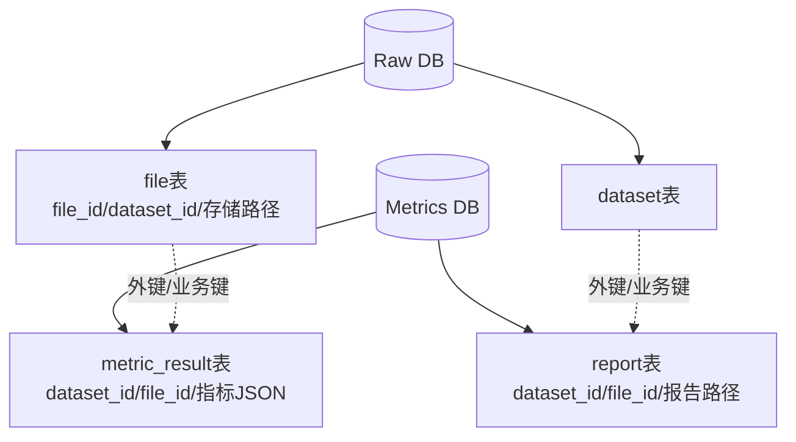

**双库关联与溯源说明（详细）**
- 关联键：`dataset_id`、`file_id`在上传登记时由后端生成并存入Raw DB，同时在离线指标上传时作为幂等与溯源键写入Metrics DB，形成“一对一或一对多（同数据集多文件）”的天然关联。
- 原始存储：Raw DB的`file`表记录OCY位置信息（bucket/object_key/checksum/size/version），不存大文件内容；OCY实际存放原始文件。
- 指标存储：Metrics DB的`metric_result`存结构化指标（JSON/数值）、`metric_blob`存大体积JSONB或外链Parquet引用；`report`表只保存报告文件的OCY路径与类型。
- 查询路径：
    1) 前端查指标 → `GET /api/datasets/{datasetId}/metrics` 或 `/api/files/{fileId}/metrics` → 后端读Metrics DB返回指标与可选报告URL。
    2) 溯源原始文件 → 前端用同一对`datasetId`/`fileId`调用`GET /api/files/{fileId}` → 后端查Raw DB生成OCY签名URL → 前端下载/预览。
- 幂等与版本：
    - 指标上传若相同`dataset_id`/`file_id` + `metric_type`已存在，可选择覆盖或新版本字段（如`version`/`calculated_at`）。
    - 报告记录同样以`dataset_id`/`file_id` + `report_type`作为唯一键或唯一约束，避免重复。
- 数据一致性：不做跨库JOIN；读时在应用层合并。可用定时任务/物化视图在Metrics侧生成只读汇总表以加速前端查询。

### 文件解析与离线处理详细流程

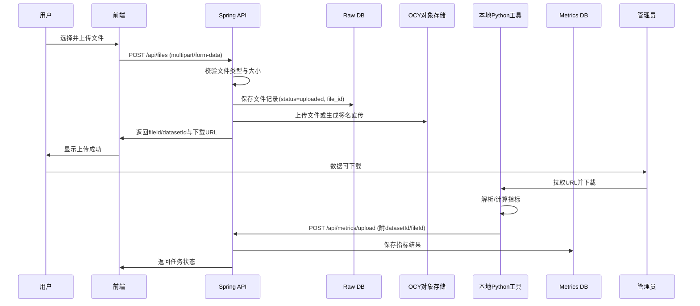

---

## 数据库到后端交互

### ORM映射机制（Spring Data JPA，双数据源）

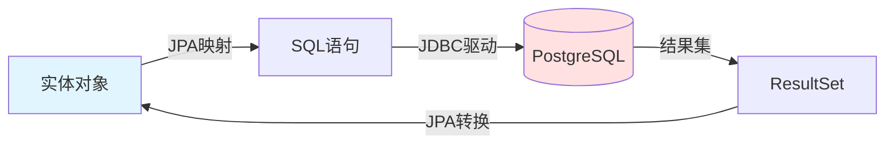

**双数据源要点：**
- 配置Raw DB与Metrics DB独立`DataSource`/`EntityManagerFactory`，按包或注解区分Repository。
- 公共标识：`dataset_id`、`file_id`在两库保持全局唯一，生成逻辑放在后端统一下发。
- 若跨库联合查询，前端通过两次API合并或后端采用只读中间视图/物化表（同步任务），避免跨库JOIN性能问题。

### 数据库操作流程

#### 1. 查询流程

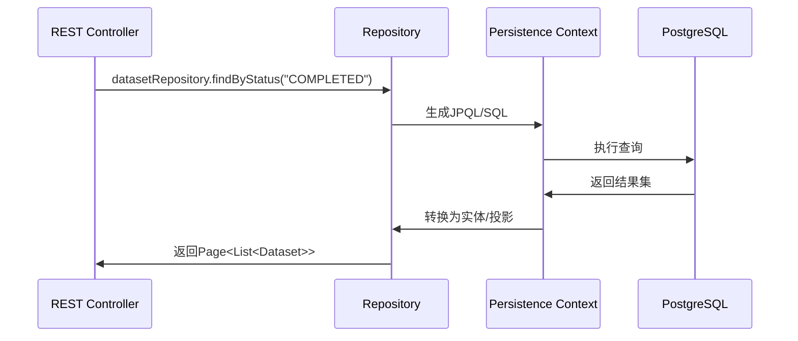

**要点：**
1. 方法名派生查询或`@Query`自定义查询
2. JPA转换结果为实体/DTO
3. 支持`Pageable`分页、`Specification`动态条件

#### 2. 创建流程

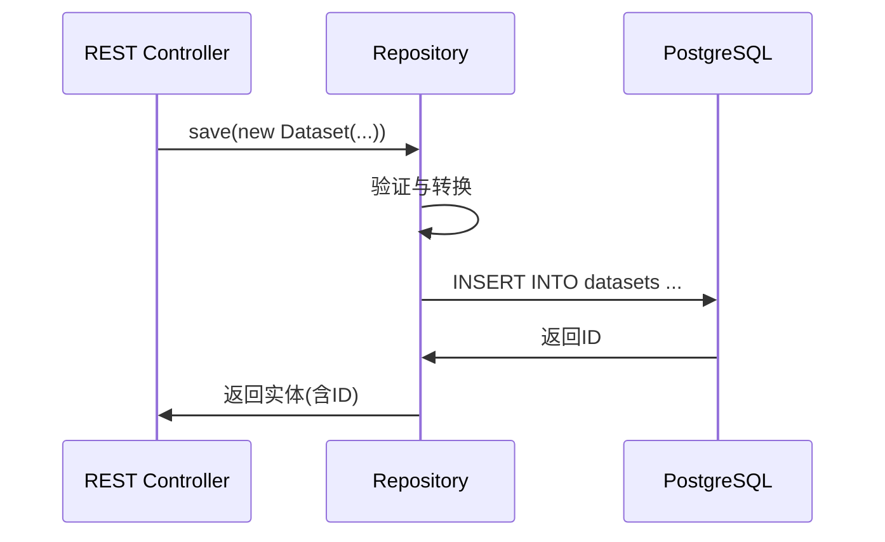

**要点：** 事务由`@Transactional`管理，失败自动回滚。

#### 3. 更新流程

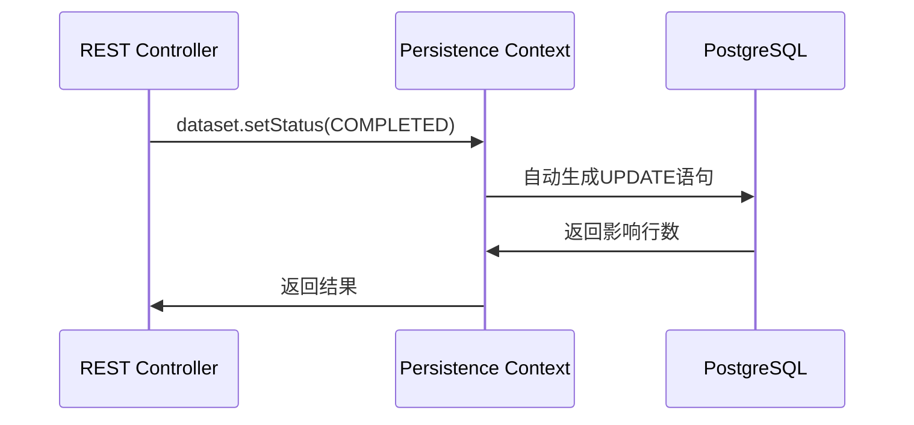

**要点：**
- 脏检查：持久化上下文检测变更字段，按需更新
- 事件：可通过`ApplicationEvent`或`Domain Event`触发后置处理

### 复杂查询优化

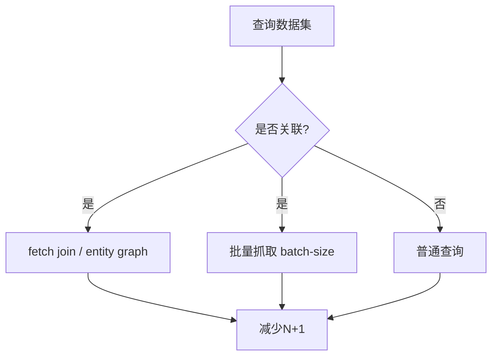

**优化策略：**
- `@EntityGraph`或`JOIN FETCH`避免N+1
- `@BatchSize`或`hibernate.default_batch_fetch_size`批量抓取
- `Pageable`分页与`Slice`流式查询
- 只选必要字段：DTO投影或`@Query`选择列

### 连接池与事务

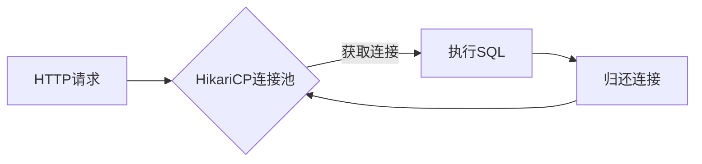

**配置要点：**
- `maximumPoolSize`、`connectionTimeout`、`idleTimeout`合理设置
- `spring.jpa.open-in-view=false`避免视图层懒加载问题
- 事务边界由Service层`@Transactional`控制

---

## 后端到前端交互

### RESTful API设计规范

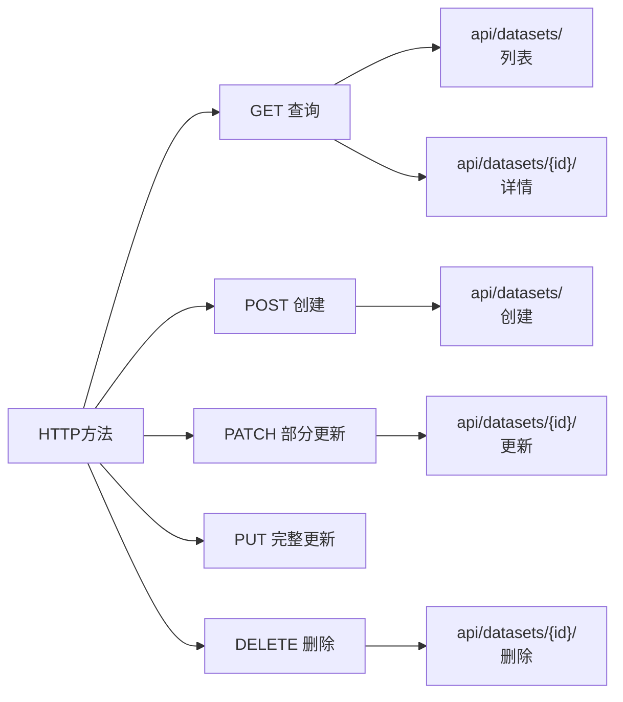

**端点命名：**
- 集合：`/api/datasets/`
- 单体：`/api/datasets/{id}/`
- 自定义动作：`/api/datasets/{id}/quality/`
- 嵌套：`/api/datasets/{id}/files/`

### HTTP请求-响应流程

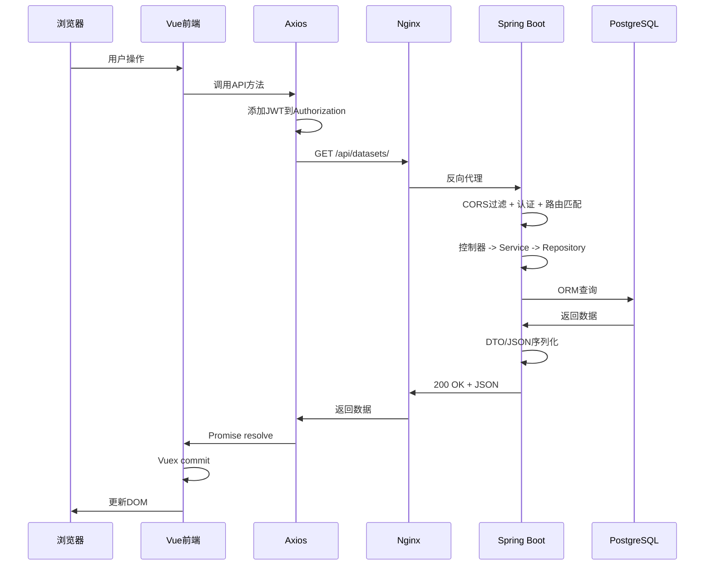

### 序列化与反序列化

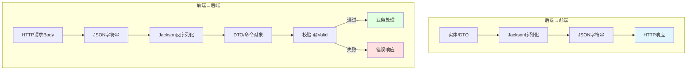

### 前端状态管理流程

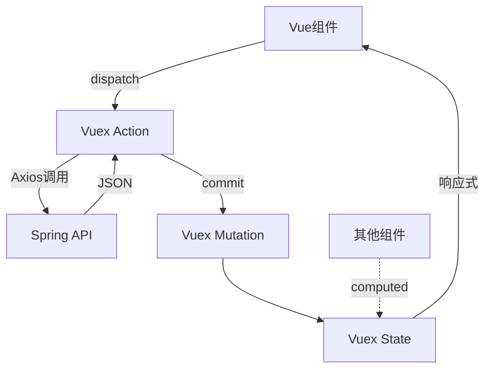

### Axios拦截器

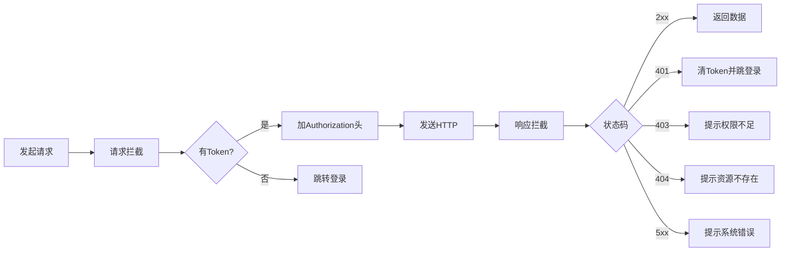

---

## 完整业务流程

### 业务流程1：原始数据上传（Raw DB）

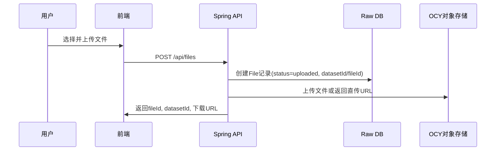

### 业务流程2：离线指标计算（本地Python）

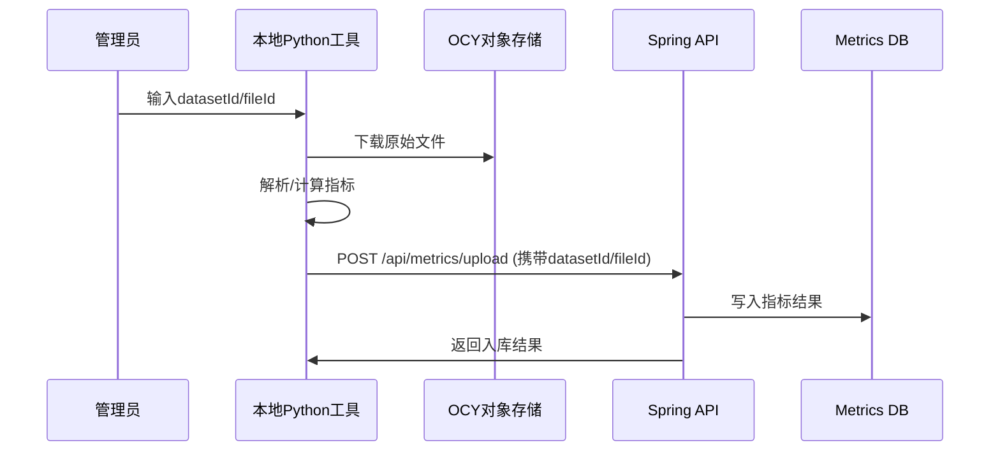

### 业务流程3：前端展示与溯源

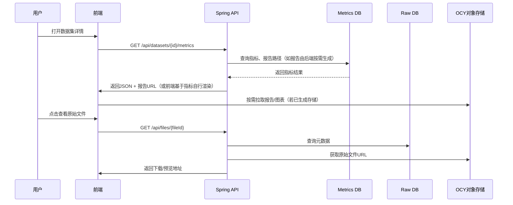

### 关键技术交互

1. **异步任务**：RabbitMQ + Spring AMQP；可用`RetryTemplate`或死信队列做重试
2. **数据质量**：缺失率、异常值检测（IQR/Z-score）、业务一致性校验，结果入库并可视化
3. **文件类型策略**：
    - BLF/ASC：python-can/cantools在离线工具解析，DBC解码信号
    - XLSX：Apache POI（上传侧校验）；离线工具可用OpenPyXL/pyarrow二次处理
    - MDF（可选）：Python侧解析后回传指标
4. **报告生成**：基于Metrics DB数据由后端Reports服务或前端渲染生成，脱离离线工具
5. **性能优化**：批量写入`JdbcTemplate`/Batch，复制表`CREATE TABLE ... AS`，合理索引与分区
6. **安全**：JWT无状态认证，方法级`@PreAuthorize`，审计日志记录关键操作

---

## 文档说明

本文档以Spring Boot + PostgreSQL + Vue技术栈描述系统的技术栈、架构设计、数据流程与交互逻辑。

### 相关文档
- 技术文档：TECHNICAL_DOCUMENTATION.md（需同步更新为Java版）
- 项目总结：../PROJECT_SUMMARY.md
- README：../README.md

---

*最后更新时间: 2025年12月29日*
