# 数据集管理系统 - Spring Boot版完整交互逻辑说明

## 目录
1. [技术栈说明](#技术栈说明)
2. [系统架构](#系统架构)
3. [数据流程](#数据流程)
4. [数据库到后端交互](#数据库到后端交互)
5. [后端到前端交互](#后端到前端交互)
6. [完整业务流程](#完整业务流程)
7. [文档说明](#文档说明)

---

## 技术栈说明

### 后端技术栈（Java）

| 技术组件 | 版本 | 作用说明 |
|---------|------|---------|
| **Java** | 17+ | 后端开发语言，长期支持版本 |
| **Spring Boot** | 3.x | 应用框架，整合MVC、安全、数据访问、消息、定时等能力 |
| **Spring MVC** |  | Web层，提供REST API与拦截器体系 |
| **Spring Security** | 6.x | 认证授权，支持JWT/Token，方法级鉴权 |
| **Spring Data JPA** |  | ORM层，简化PostgreSQL数据访问，支持分页与审计 |
| **Spring AMQP / RabbitMQ** |  | 消息队列，分发解析、指标计算、报告生成等异步任务 |
| **Spring Batch** |  | 批处理框架，可用于大批量数据导入与转换 |
| **springdoc-openapi** | 2.x | 自动生成OpenAPI 3.0文档与Swagger UI |
| **PostgreSQL Driver** |  | JDBC驱动，与数据库通信 |
| **Redis (lettuce)** | 6+ | 缓存与分布式锁，可选任务进度存储 |
| **Apache POI** | 5.x | Excel/Word/PPT读写与报告生成 |
| **Jackson / OpenCSV** |  | CSV/JSON解析工具链 |
| **java-can / j1939 等 CAN 库** |  | 解析BLF/ASC等车辆CAN日志，结合DBC信号解码 |
| **JFreeChart / XChart** |  | 服务器侧图表生成（如需要导出PNG/SVG） |

### 前端技术栈

| 技术组件 | 版本 | 作用说明 |
|---------|------|---------|
| **Vue.js** | 3 | 构建SPA界面 |
| **Vue Router** | 4 | 路由管理 |
| **Vuex** | 4 | 全局状态管理（数据集、文件、指标、报告） |
| **Element Plus** |  | UI组件库（表格/表单/对话框） |
| **ECharts** |  | 数据可视化图表 |
| **Axios** |  | HTTP客户端，封装认证与错误处理 |

### 中间件与工具

| 组件 | 作用说明 |
|-----|---------|
| **RabbitMQ** | 任务队列与消息分发 |
| **Nginx** | 反向代理与静态资源分发，HTTPS终结 |
| **Docker / Docker Compose** | 部署编排，隔离服务依赖 |
| **Flyway / Liquibase** | 数据库变更管理，保证DDL一致性 |
| **Lombok / MapStruct** | 代码简化与DTO映射 |

---

## 系统架构

### 整体架构图

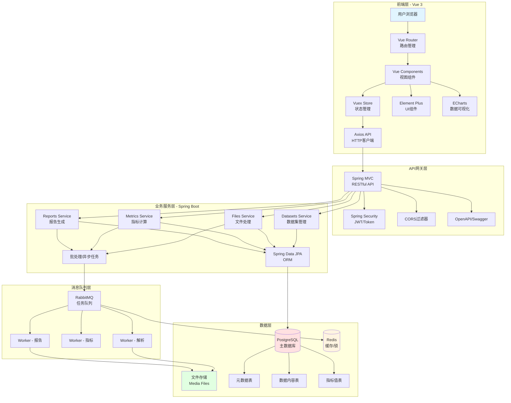

### 架构层次说明

**1. 前端层 (Vue 3)**
- 路由与导航：Vue Router管理6个主要页面
- 状态管理：Vuex集中管理数据集、文件、指标、报告
- UI与可视化：Element Plus + ECharts
- API通信：Axios统一封装Token、超时与错误

**2. API网关层**
- RESTful API：Spring MVC控制器 + 全局异常处理
- 认证授权：Spring Security + JWT，方法级鉴权
- 跨域：CORS过滤器支持前后端分离
- API文档：springdoc-openapi生成OpenAPI/Swagger UI

**3. 业务服务层**
- Datasets服务：CRUD、统计、质量评估
- Files服务：上传、格式验证、解析调度
- Metrics服务：定义、计算、聚合
- Reports服务：模板、文档生成、图表渲染
- 异步/批处理：Spring AMQP + Worker，或Spring Batch处理大批量导入

**4. 数据层**
- PostgreSQL：存储核心业务表与动态数据表
- Redis：缓存热点数据、分布式锁、可选进度存储
- 文件存储：原始文件、导出报告、图表截图

---

## 数据流程

### 完整数据处理流程

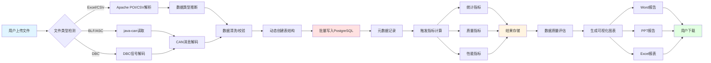

### 文件解析详细流程

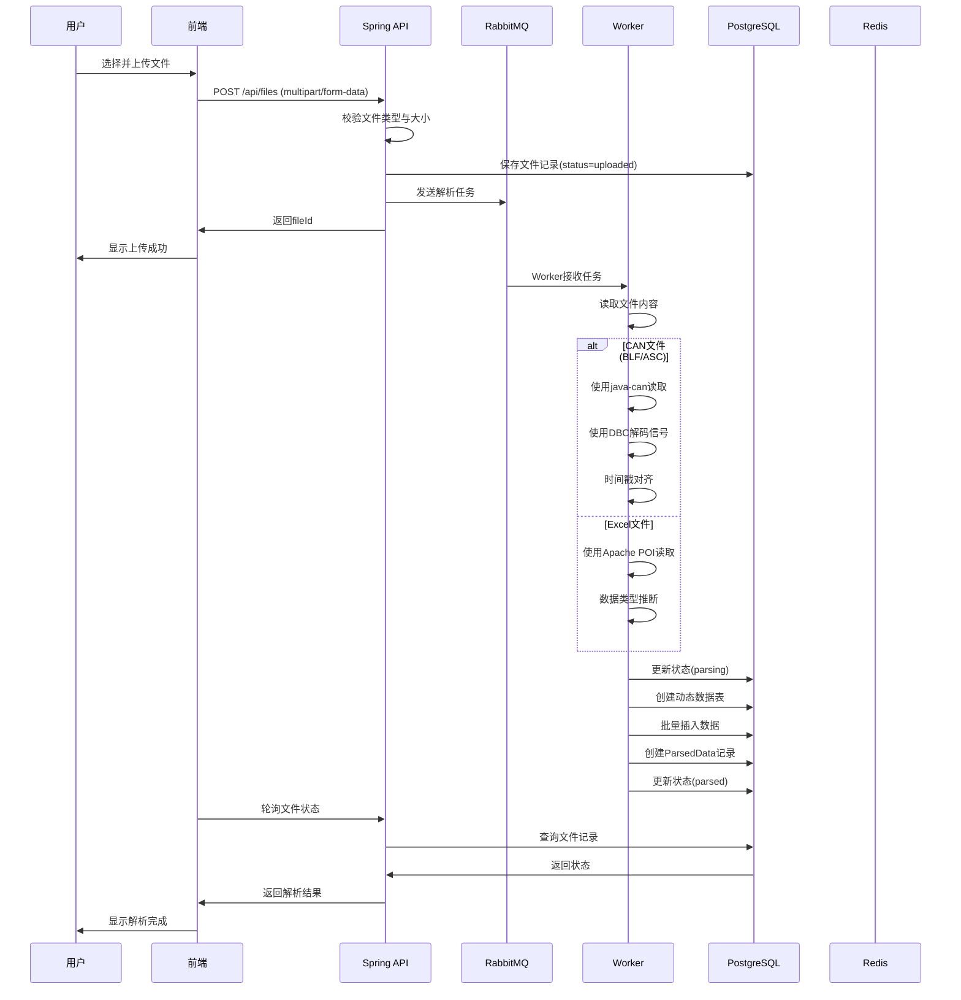

---

## 数据库到后端交互

### ORM映射机制（Spring Data JPA）

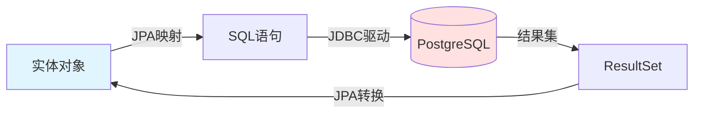

### 数据库操作流程

#### 1. 查询流程

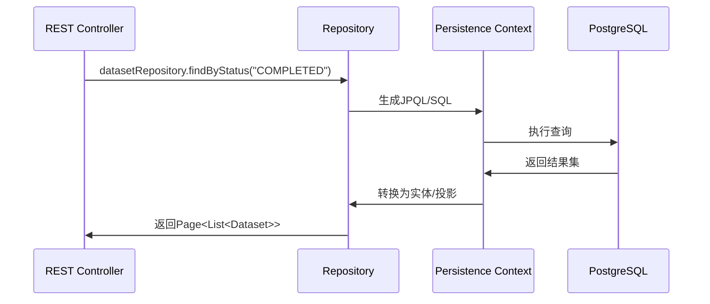

**要点：**
1. 方法名派生查询或`@Query`自定义查询
2. JPA转换结果为实体/DTO
3. 支持`Pageable`分页、`Specification`动态条件

#### 2. 创建流程

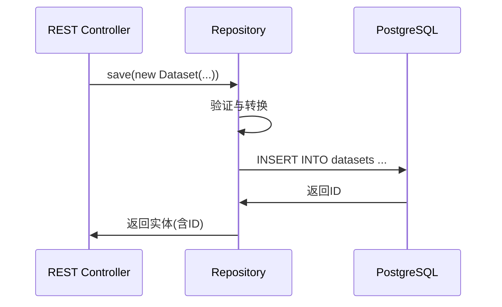

**要点：** 事务由`@Transactional`管理，失败自动回滚。

#### 3. 更新流程

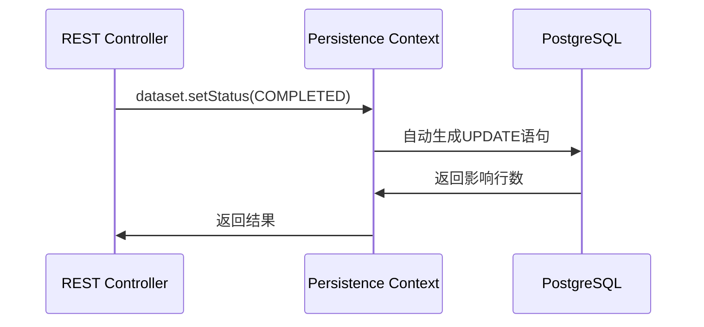

**要点：**
- 脏检查：持久化上下文检测变更字段，按需更新
- 事件：可通过`ApplicationEvent`或`Domain Event`触发后置处理

### 复杂查询优化

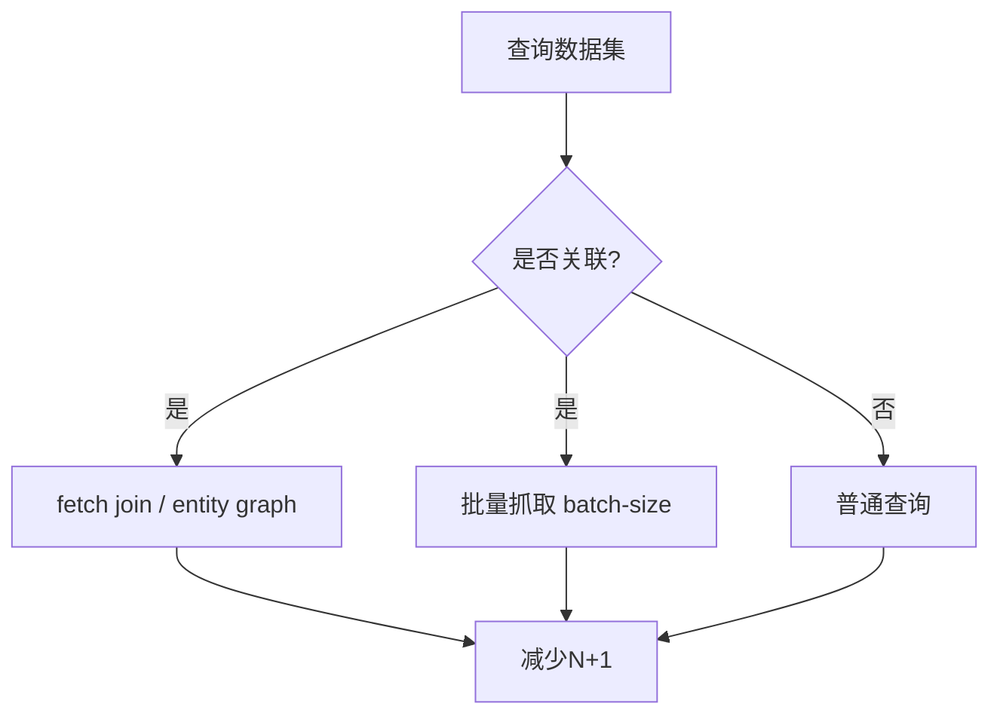

**优化策略：**
- `@EntityGraph`或`JOIN FETCH`避免N+1
- `@BatchSize`或`hibernate.default_batch_fetch_size`批量抓取
- `Pageable`分页与`Slice`流式查询
- 只选必要字段：DTO投影或`@Query`选择列

### 连接池与事务

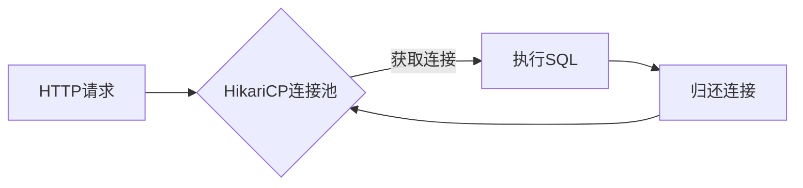

**配置要点：**
- `maximumPoolSize`、`connectionTimeout`、`idleTimeout`合理设置
- `spring.jpa.open-in-view=false`避免视图层懒加载问题
- 事务边界由Service层`@Transactional`控制

---

## 后端到前端交互

### RESTful API设计规范

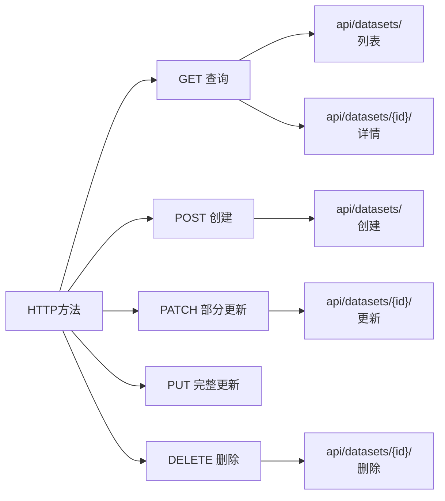

**端点命名：**
- 集合：`/api/datasets/`
- 单体：`/api/datasets/{id}/`
- 自定义动作：`/api/datasets/{id}/quality/`
- 嵌套：`/api/datasets/{id}/files/`

### HTTP请求-响应流程

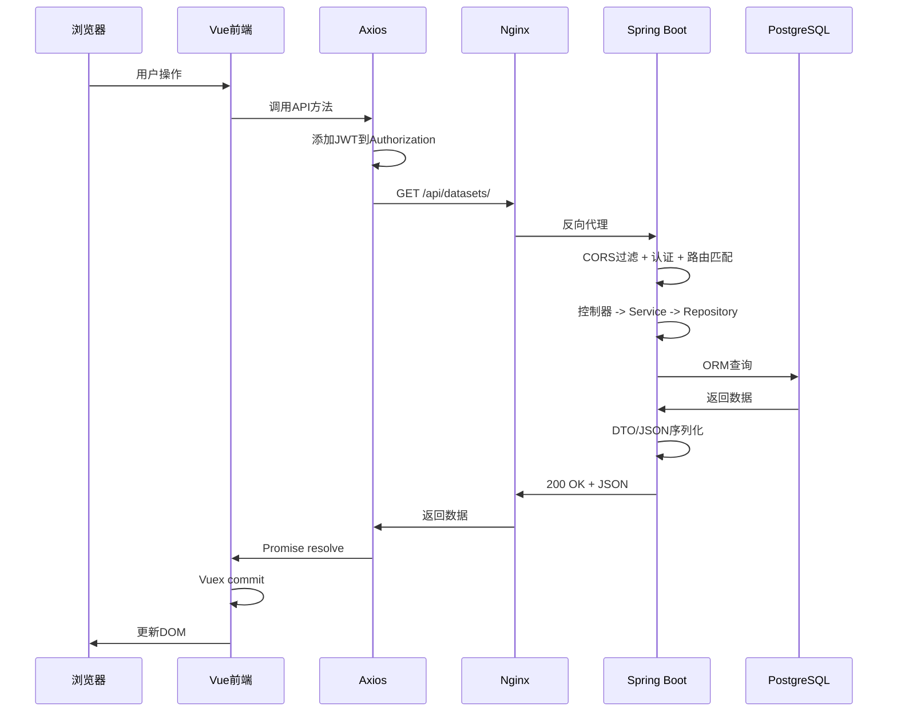

### 序列化与反序列化

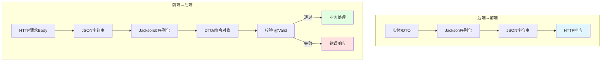

### 前端状态管理流程

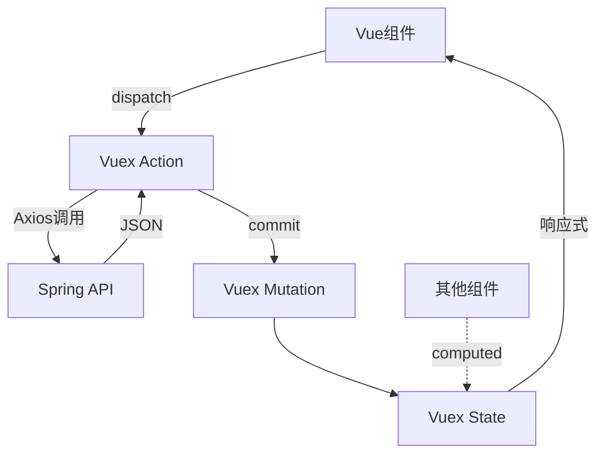

### Axios拦截器

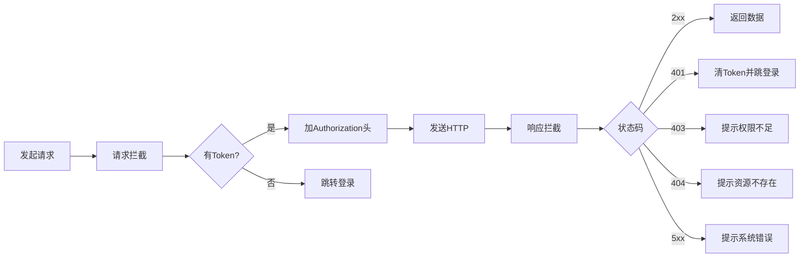

---

## 完整业务流程

### 业务流程1：文件上传与解析

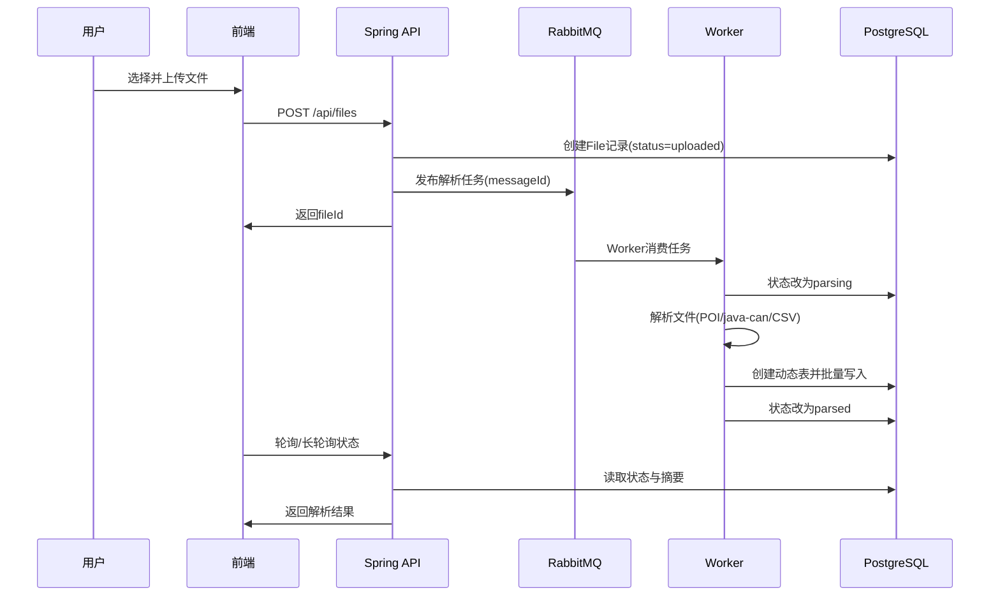

### 业务流程2：指标计算与报告生成

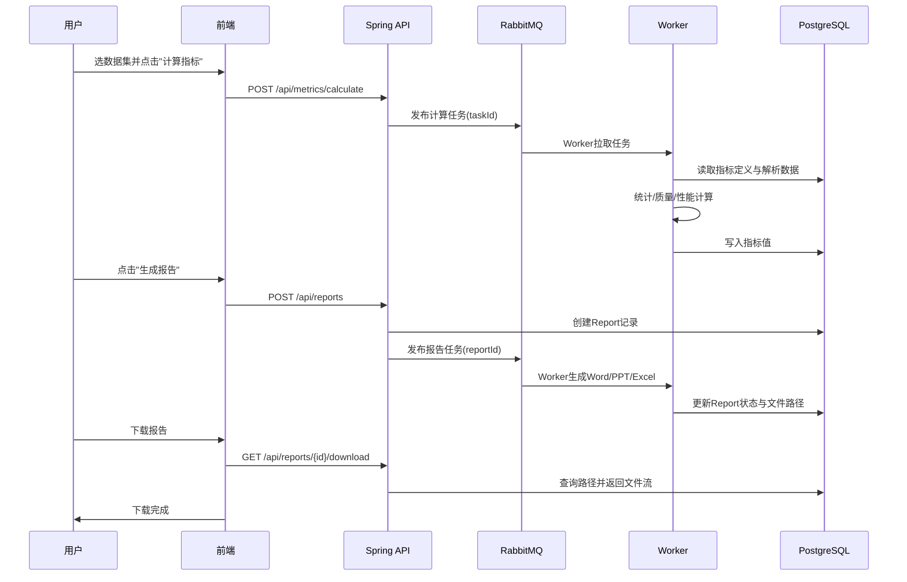

### 关键技术交互

1. **异步任务**：RabbitMQ + Spring AMQP；可用`RetryTemplate`或死信队列做重试
2. **数据质量**：缺失率、异常值检测（IQR/Z-score）、业务一致性校验，结果入库并可视化
3. **文件类型策略**：
   - BLF/ASC：java-can读取，DBC解码信号
   - XLSX：Apache POI；CSV：OpenCSV/Jackson
   - MDF（可选）：使用`mdfreader`的Java替代方案或JNI扩展
4. **性能优化**：批量写入`JdbcTemplate`/Batch，复制表`CREATE TABLE ... AS`，合理索引与分区
5. **安全**：JWT无状态认证，方法级`@PreAuthorize`，审计日志记录关键操作

---

## 文档说明

本文档以Spring Boot + PostgreSQL + Vue技术栈描述系统的技术栈、架构设计、数据流程与交互逻辑。

### 相关文档
- 技术文档：TECHNICAL_DOCUMENTATION.md（需同步更新为Java版）
- 项目总结：../PROJECT_SUMMARY.md
- README：../README.md

---

*最后更新时间: 2025年12月29日*
